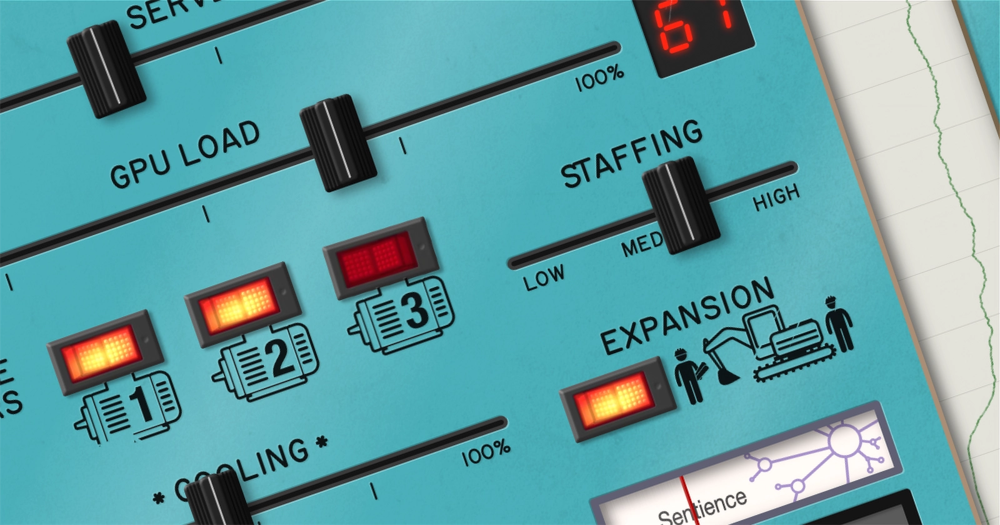

# DataCenter.FM, the sound of AI

AI is sprouting up *everywhere* nowadays, and not only online; it also requires vast data centres filled with millions of GPUs.

I wanted to explore the issues around this physical presence in an original way, ending up bringing together two things: soothing audio generator apps used for relaxation/focus, and the interactive panels you find in some museums for exploring information or how systems work (my school once had a trip to a nuclear power exhibition; predictably, every child immediately tried to send the reactor simulator into meltdown).

**[DataCenter.FM](https://datacenter.fm)** hands you the controls of a server farm, operating a simple simulation that turns your inputs into audiovisual outputs. Moving sliders and flicking switches can take the system from gentle whirring to a screaming cacophony accompanied by indicators and warning lights.

At its core, the sound generator plays 8 loops for servers, cooling, gas turbines and construction work, constantly adjusting volumes, panning and pitch/speed to reflect the current state. 27 non-looped sounds add human activity and alarms.

Audio files created by [Dean Salant](https://www.instagram.com/denz_thehuman/) are manipulated via [howler.js](https://howlerjs.com). The graphics are custom illustrations combined with public domain icons and textures, and the main font is [Routed Gothic](https://webonastick.com/fonts/routed-gothic/).

[Take it for a spin](https://datacenter.fm) and see what sounds you can make, but watch out if you leave it chugging for a while — when the AI reaches sentience, it might have its own ideas about how to run things…
